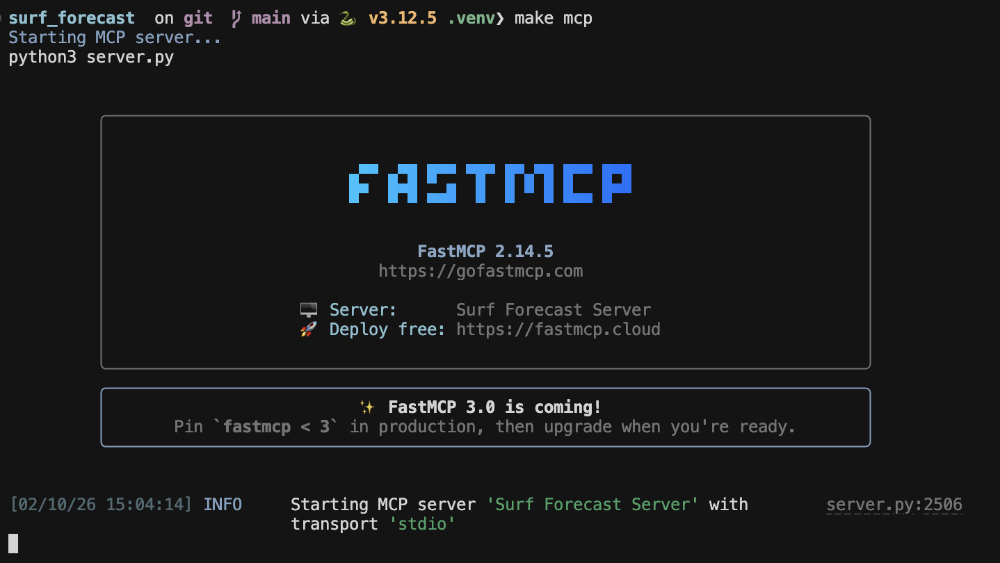

# Surf Forecast MCP

A Python-based MCP that uses the Open-Meteo Marine API (free, no API key required) to forecast swell height, swell period, swell direction, and wind conditions. Search for any city name and the system will automatically convert it to latitude and longitude coordinates to retrieve weather data and wave forecasts. Includes a surf forecast MCP server that provides wave and surf conditions for any location worldwide.

You can use the backend or view the results for better understanding using Streamlit.


## Running the MCP Server 🔥



## How to start

```bash
# 1) criar e ativar venv (opcional)
python -m venv .venv
source .venv/bin/activate  # mac/linux
# .venv\Scripts\activate  # windows

# 2) instalar deps
pip install -r requirements.txt

# 3) run the Surf Forecast API
uvicorn backend.main:app --reload

# 4) run the frontend (Streamlit)
python -m streamlit run frontend/app.py
```


## Key Makefile targets (use `make help` to see in terminal)

```bash
  make help          - Show this help message
  make setup         - Create virtual environment and install dependencies
  make install       - Install dependencies
  make install-dev   - Install dependencies + dev tools (black, ruff)
  make venv          - Create virtual environment
  make format        - Format code with black
  make lint          - Lint code with ruff
  make check         - Format and lint code
  make server        - Run FastAPI backend (uvicorn)
  make mcp           - Run MCP server
  make frontend      - Run Streamlit frontend
  make test          - Run tests (if available)
  make clean         - Remove cache and temporary files
  make clean-all     - Clean everything including virtual environment
  make dev           - Setup development environment
```


## Response Example: Using Pydantic principles and FastAPI

```json
{
  "location": "Monte de Caparica, Almada, Setúbal, 2825-096, Portugal",
  "latitude": 38.6637429,
  "longitude": -9.198197,
  "current_conditions": {
    "timestamp": "2026-01-31T00:00",
    "wave_height_m": 4.5,
    "swell_wave_height_m": 4.42,
    "wind_wave_height_m": 0.8,
    "wave_direction_deg": 289,
    "swell_wave_direction_deg": 289,
    "wave_period_s": 12.15,
    "swell_wave_period_s": 10.4,
    "wind_speed_knots": 9,
    "wind_direction_deg": 288,
    "wind_gusts_knots": 23.1,
    "temperature_c": 12.5
  },
  "hourly_forecast": [
    {
      "timestamp": "2026-01-31T03:00",
      "wave_height_m": 4.4,
      "swell_wave_height_m": 4.36,
      "wind_wave_height_m": 0.48,
      "wave_direction_deg": 291,
      "swell_wave_direction_deg": 291,
      "wave_period_s": 12.4,
      "swell_wave_period_s": 10.45,
      "wind_speed_knots": 5.9,
      "wind_direction_deg": 278,
      "wind_gusts_knots": 15.9,
      "temperature_c": 11.7
    },
    {
      "timestamp": "2026-01-31T06:00",
      "wave_height_m": 4.24,
      "swell_wave_height_m": 4.22,
      "wind_wave_height_m": 0.42,
      "wave_direction_deg": 292,
      "swell_wave_direction_deg": 292,
      "wave_period_s": 12.5,
      "swell_wave_period_s": 10.55,
      "wind_speed_knots": 4.1,
      "wind_direction_deg": 275,
      "wind_gusts_knots": 13.6,
      "temperature_c": 10.9
    },
    {
      "timestamp": "2026-01-31T09:00",
      "wave_height_m": 4.06,
      "swell_wave_height_m": 4.04,
      "wind_wave_height_m": 0.32,
      "wave_direction_deg": 293,
      "swell_wave_direction_deg": 293,
      "wave_period_s": 12.5,
      "swell_wave_period_s": 10.5,
      "wind_speed_knots": 4.5,
      "wind_direction_deg": 263,
      "wind_gusts_knots": 11.3,
      "temperature_c": 11.7
    },
    {
      "timestamp": "2026-01-31T12:00",
      "wave_height_m": 3.9,
      "swell_wave_height_m": 3.88,
      "wind_wave_height_m": 0.3,
      "wave_direction_deg": 294,
      "swell_wave_direction_deg": 294,
      "wave_period_s": 12.5,
      "swell_wave_period_s": 10.5,
      "wind_speed_knots": 7.3,
      "wind_direction_deg": 279,
      "wind_gusts_knots": 18.9,
      "temperature_c": 14.6
    }
  ],
  "forecast_5day": [
    {
      "date": "2026-01-31",
      "wave_height_max_m": 4.5,
      "swell_wave_height_max_m": 4.42,
      "wind_wave_height_max_m": 0.8,
      "wave_direction_dominant_deg": 292,
      "swell_wave_direction_dominant_deg": 292,
      "wave_period_max_s": 12.6,
      "swell_wave_period_max_s": 10.6,
      "wind_speed_max_knots": 9,
      "wind_direction_dominant_deg": 262,
      "wind_gusts_max_knots": 23.1,
      "temperature_max_c": 15.2,
      "temperature_min_c": 10.9
    },
    {
      "date": "2026-02-01",
      "wave_height_max_m": 3.16,
      "swell_wave_height_max_m": 3.12,
      "wind_wave_height_max_m": 1.28,
      "wave_direction_dominant_deg": 283,
      "swell_wave_direction_dominant_deg": 289,
      "wave_period_max_s": 12.35,
      "swell_wave_period_max_s": 11.2,
      "wind_speed_max_knots": 12.5,
      "wind_direction_dominant_deg": 223,
      "wind_gusts_max_knots": 30.7,
      "temperature_max_c": 15.1,
      "temperature_min_c": 13.3
    },
    {
      "date": "2026-02-02",
      "wave_height_max_m": 3.8,
      "swell_wave_height_max_m": 3.78,
      "wind_wave_height_max_m": 2.3,
      "wave_direction_dominant_deg": 274,
      "swell_wave_direction_dominant_deg": 284,
      "wave_period_max_s": 11.15,
      "swell_wave_period_max_s": 11.85,
      "wind_speed_max_knots": 16.1,
      "wind_direction_dominant_deg": 254,
      "wind_gusts_max_knots": 48,
      "temperature_max_c": 13.9,
      "temperature_min_c": 9.8
    },
    {
      "date": "2026-02-03",
      "wave_height_max_m": 4.82,
      "swell_wave_height_max_m": 4.26,
      "wind_wave_height_max_m": 2.32,
      "wave_direction_dominant_deg": 279,
      "swell_wave_direction_dominant_deg": 283,
      "wave_period_max_s": 12.1,
      "swell_wave_period_max_s": 10.95,
      "wind_speed_max_knots": 12,
      "wind_direction_dominant_deg": 247,
      "wind_gusts_max_knots": 32.5,
      "temperature_max_c": 14,
      "temperature_min_c": 9.4
    },
    {
      "date": "2026-02-04",
      "wave_height_max_m": 4.98,
      "swell_wave_height_max_m": 4.48,
      "wind_wave_height_max_m": 2.4,
      "wave_direction_dominant_deg": 270,
      "swell_wave_direction_dominant_deg": 281,
      "wave_period_max_s": 11.05,
      "swell_wave_period_max_s": 10.6,
      "wind_speed_max_knots": 15.9,
      "wind_direction_dominant_deg": 248,
      "wind_gusts_max_knots": 38.7,
      "temperature_max_c": 15.4,
      "temperature_min_c": 14.8
    }
  ],
  "surf_quality_notes": "big waves - advanced surfers only | light breeze - good conditions | long period swell - clean waves expected | swell dominant - cleaner conditions"
}
```

